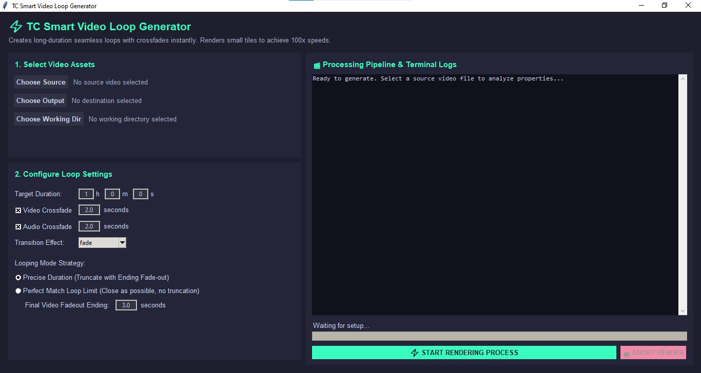

# ⚡ TC Smart Video Loop Generator

Transform short video clips into **flawlessly seamless, ultra-long infinite loops** in seconds! Powered by selective FFmpeg re-encoding for ultra-fast render speeds.

  

## ✨ Features
* **Seamless Crossfades:** Customizable video and audio crossfades.
* **Fast Rendering:** Re-encodes only boundary transition tiles.
* **Click-Free Audio:** Rebuilds continuous audio streams without clicks or pops.

## 🎬 Sample Video Output
Check out this 6-hour relaxing music video generated using this app. See if you can spot the seamless loop boundary around **3:59**!

*💡 Click image above to watch on YouTube (Smooth visual crossfade + zero audio clicks at transition tiles).*

---

### Note for Malaysian supporters 🇲🇾

For supporters in Malaysia: Should you wish to support our initiative through a local funds transfer, the DuitNow QR code below is available for your convenience.

  

Thank you!
